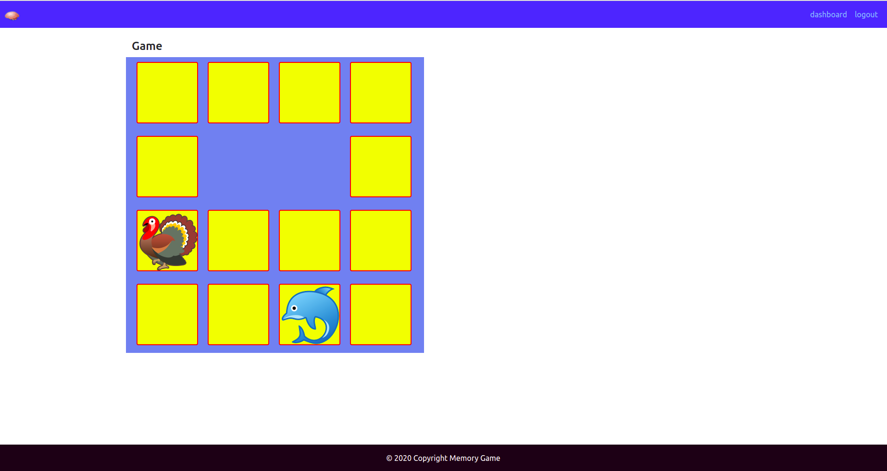

# Memory Game

## Description
This is a single player game.  On each turn, a player must turn over two cards,
which do not match, these cards are turned over again.
If the cards match, we remove those cards from board. The game is over,
when the board is empty. On the beginning game player get 100 points and every turn,
each mistake is punished by subtracting 5 points.

## Requirements

Python 3.10 is required!
```bash
python3 --version
```

## Development

Install packages
```bash
pip install -r requirements.txt
```
Next create db and run migrations, upload images 
and run application
```bash
python3 manage.py migrate
python3 manage.py upload_images
python3 manage.py runserver
```

## Tests

Run this command in your shell
```bash
python3 manage.py test
```

## Application

Memory game


Dashboard
